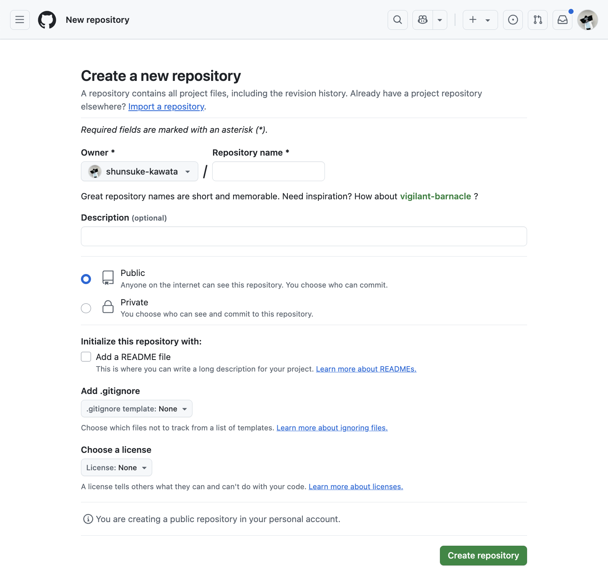
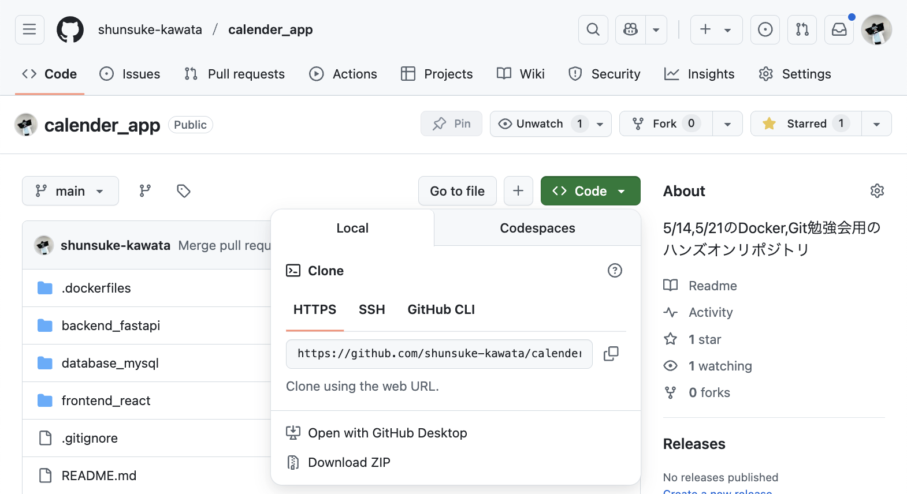

# カレンダーアプリ

## 概要
Docker,Git勉強会用のリポジトリ(2025/07/14,2025/07/21)

## 目的
- Dockerを用いた開発をやってみる
- Gitを用いたチーム開発をやってみる
- 中山研のイベントをまとめたカレンダーアプリを作成したい

## 使用技術

|  |  |
| ---- | ---- |
| フロントエンド | TypeScript,React,Vite |
| バックエンド | Python,FastAPI |
| データベース | SQL,MySQL |
| コンテナ | Docker |

## 環境構築

(以降の操作は Linux系のシェルからのCUI操作を想定しています。MacOSの人はターミナル,WindowsOSの人はGit Bashを推奨します。WSLでUbuntuを使用している人はそれで良いです。)

0. Docker,Gitを使用できる状態にしておく
   
   #### ~~Githubにssh接続のために秘密鍵を登録する必要がある~~

   #### やらなくても良い場合もあるらしいので一旦手順1のhttpsのクローン手順をやってみてください。その手順でできない場合こちらの手順を参照してください


   1. ユーザディレクトリのルートに移動
   
        ```cd ~```

   1. `.ssh`ディレクトリに移動する。なければ作成してから移動する

        `cd .ssh` 作成する場合は `mkdir .ssh` を先に実行する

   1. 鍵を生成する

        ```ssh-keygen -t rsa```

        このコマンドを打った後、質問が聞かれるので全て何も入力せずにEnterでOK

        このコマンドによって`.ssh`ディレクトリに`id_rsa`と`id_rsa.pub`という名前のファイルが生成される
    
   1. `id_rsa.pub`の中身をGithubの公開鍵に登録する
    
        https://github.com/settings/ssh で公開鍵を設定することができる

    - ファイルの中身をコピーするコマンド（直接ファイルをエディタなどで開いてGUIでコピーしてもOK）

        ```pbcopy < ~/.ssh/id_rsa.pub``` (Mac)

        ```clip < ~/.ssh/id_rsa.pub``` (Windows)

    [Github SSH接続 参考サイト](https://qiita.com/shizuma/items/2b2f873a0034839e47ce)

#### gitのリポジトリ関係の手順について1.2の手順は代表者が行い、3の手順は代表者の作業後にそれ以外のメンバーが行ってください

1. 本リポジトリを任意のディレクトリにクローンする
   
   ```git clone https://github.com/shunsuke-kawata/calender_app.git```

   上記コマンドでできない人は0の手順を実行しsshキーを利用してクローンする

    ```git clone git@github.com:shunsuke-kawata/calender_app.git```

2. リモートリポジトリのURLを変更する

    1. 自分のgitアカウントにからの新規リポジトリを作成する
    
        https://github.com/new で新規リポジトリを作成できる

        下記画面で以下のように設定して `Create repository`

        - Repository name : `calender_app`
        - Description : なんでもいいです
        - Public/Private : `Public`
        -  Initialize this repository with > Add a README : チェックなしでお願いします
        -  Add .gitignore : None
        -  Choose a license : None
  
        

    2. 作成されたリポジトリのURLを確認する

        下記画面の`HTTPS`もしくは`SSH`のコピー欄からコピーできる(多分どちらでも可能、使用可能な場合は`SSH`の方を使用する方が好ましい)

        

    3. ローカルリポジトリのリモートリポジトリURLを確認する
        
        `git remote -v`

        クローン時にはおそらく以下のようになっています

        ```
        origin  git@github.com:shunsuke-kawata/calender_app.git (fetch)
        origin  git@github.com:shunsuke-kawata/calender_app.git (push)
        ```

    4. ローカルリポジトリのリモートリポジトリを変更する
        
        ```git remote set-url origin {作成したリポジトリURL}```

        1と同じ手順で正常にリモートリポジトリURLが変更されたか確認する
    
    5. 変更したリモートリポジトリにpushする
        
        ```git push origin main```

3. 移行した班の代表者のリポジトリをそれ以外のメンバーがクローンする

    ```git clone {作成/移行したリポジトリURL}```

#### ここから先は全員行ってください

4. 環境変数を設定する

   1. 環境変数に必要な値を取得する

        (GCPアカウント作成,カレンダー発行などの手順は割愛します。一旦なくても環境構築・アプリ起動自体はできますが下記の環境変数を設定しないとカレンダー表示ができません)
        - `GOOGLE_CALENDER_API_KEY`はGoogle Cloud PlatformコンソールからAPIキーを発行して取得
        -  `GOOGLE_CALENDER_ID`はGoogleカレンダーを作成して設定から取得
  
   2. `.env`をこのリポジトリのルートに作成して、下記の`.env`を参考にして必要な情報を記載する(docker-compose.yamlがあるところに作成してください)

        .env

        ```
        FRONTEND_PORT=xxx //フロントエンドコンテナ用のポート番号
        BACKEND_PORT=xxx //バックエンドコンテナ用のポート番号
        DATABASE_PORT=xxx //データベースコンテナ用のポート番号

        MYSQL_DATABASE=xxx //データベース名
        MYSQL_ROOT_PASSWORD=xxx //ルートユーザーのパスワード
        MYSQL_USER=xxx //一般ユーザー名
        MYSQL_PASSWORD=xxx //一般ユーザー名のパスワード
        MYSQL_HOST=xxx //ホストのURL(Dockerを使用する場合はコンテナ名を指定する)

        GOOGLE_CALENDER_API_KEY=xxx //GoogleカレンダーのAPIキー
        VITE_APP_GOOGLE_CALENDER_API_KEY=xxx //GoogleカレンダーのAPIキー(Viteで利用するためVITE_APP_をつけたもの)

        GOOGLE_CALENDER_ID=xxx //GoogleカレンダーのID
        VITE_APP_GOOGLE_CALENDER_ID=xxx //GoogleカレンダーのID(Viteで利用するためVITE_APP_をつけたもの)
        ```

1. Dockerコンテナを作成
   
   ```docker compose build``` Dockerイメージを作成

   ```docker compose up``` Dockerコンテナの起動

   ```docker compose up --build``` 上記二つを同時実行

2. 起動を確認する
   
   ```http://localhost:{FRONTEND_PORT}```でReactによるフロントエンドが起動

   ```http://localhost:{BACKEND＿PORT}```でFastAPIによるバックエンドが起動
